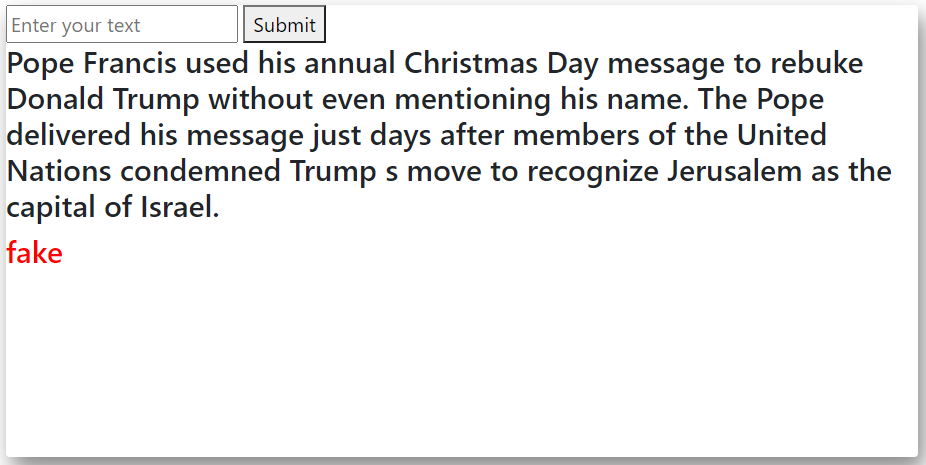
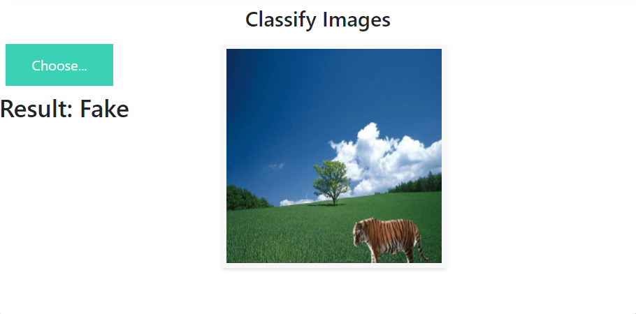
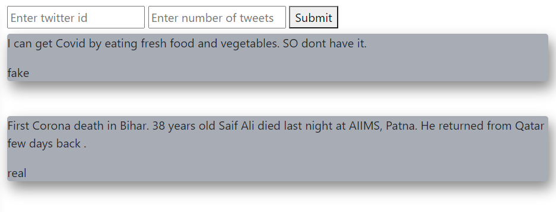

# Vastavikta-The Rumour Detector

## Overview:
A deep-learning based web application designed to classify fake news in the form of text and images along with a real-time classification of tweets. Technology stack: TensorFlow, Keras, Flask, HTML, CSS, Bootstrap, Selenium.

## Introduction:
Fake news is not a new problem for today’s world, it was since the start of the printing press. But with the growing technology and the spread of the internet, its negative impact on society and the people has increased manifold. And today with the growing number of social media platforms fake news can easily spread among a large number of internet users. There are various aspects that make the automatic detection of fake news difficult. Fake news is purposefully published to deceive viewers, making it difficult to spot based on news content alone. The spreading of fake news is not limited only to a particular domain, say politics. But it can be of different domains such as sports, environment, etc. Thus, to prevent the propagation of fake news, the following solution has been proposed.

## Methodology:
The proposed solution uses supervised learning. The dataset when created has to be pre-processed before it is fed to the model for training and testing. Once a satisfactory accuracy is achieved, the model then has to be integrated with the web application. Once the web application is ready, it can be deployed on the web.

## Dataset:
The dataset used for classification of fake news is available on www.Kaggle.com. Apart from this, we also scrapped around 2000 news articles from www.PolitiFact.com. CASIA Dataset has been used to identify fake news in the form of morphed images. The dataset for classifying tweets is small based on COVID-19 related tweets.

## Models used:
For the classification of fake news in the form of text and tweets, LSTM model has been used. CNN has been used for classifying morphed/distorted/fake images.

## Web App:
A web application has been designed by integrating the above mentioned models with the user interface. The simple user interface lets users seamlessly classify the fake news.

## UI
1. Landing Page

2. Classification of fake news in text form

3. Classification of fake news in image form

4. Real-time classification of tweets

